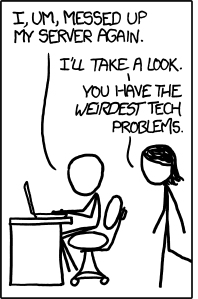

# WordPress Blog Outage Incident Report

    

We experieced an outage on our site's blog earlier in the week. This report provides a look into what went wrong on our side, how we fixed it and the measures we've since put in place.

## Issue Summary

On Wednesday 19th June 2024, our website's blog was unavailable from 10:20AM to 11:10AM EAT. All requests to the blog subdomain resulted in 500 error responses meaning 100% of visitors to our blog got the dreaded `Internal Server Error`. The cause was a misconfiguration in a WordPress settings file.

## Timeline (East African Time: _GMT+3_)

- 10:00 AM: Reconfiguration deployed
- 10:10 AM: Initial outage reports from blog visitors
- 10:23 AM: 100% failed requests rate
- 10:25 AM: Site Reliability team notified
- 11:00 AM: Misconfiguration detected and fixed
- 11:05 AM: Redeployment
- 11:10 AM: WE ARE SO BACK!!!

## Root Cause

A typo in the WordPress configuration file `wp-settings.php` had WP trying to find a nonexistent file. This was discovered by checking `strace` logs.

## Resolution and Recovery

The fix was straughforward: replacing the errorneous `.phpp` extension with the correct `.php` extension and restarting the server

## Corrective and Preventative Measures

We have developed a script for checking correctness of WordPress configuration files to avoid server errors stemming from server misconfiguration.
